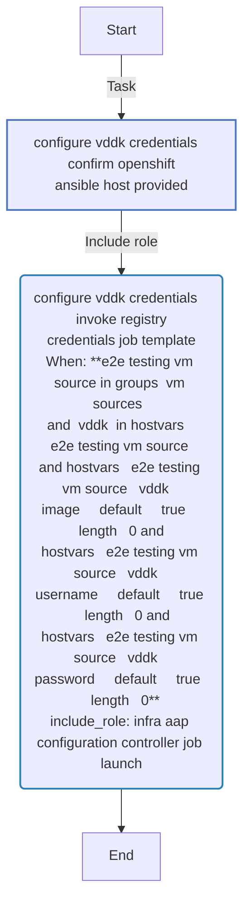
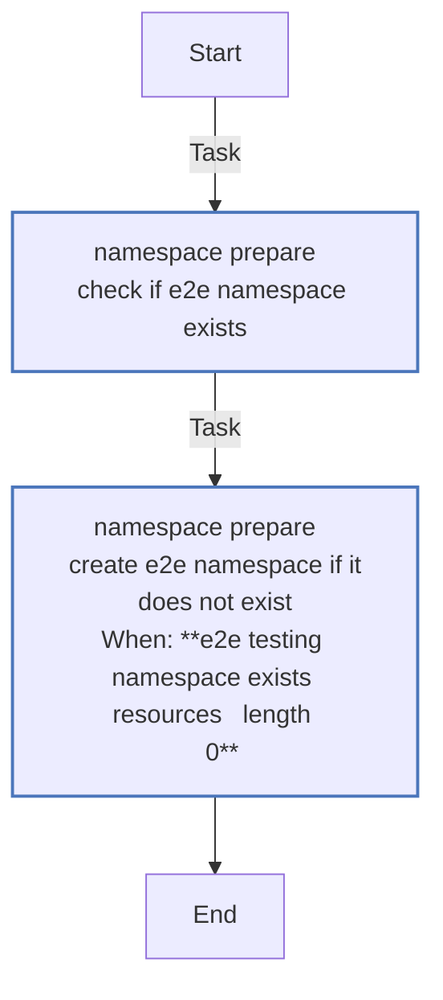
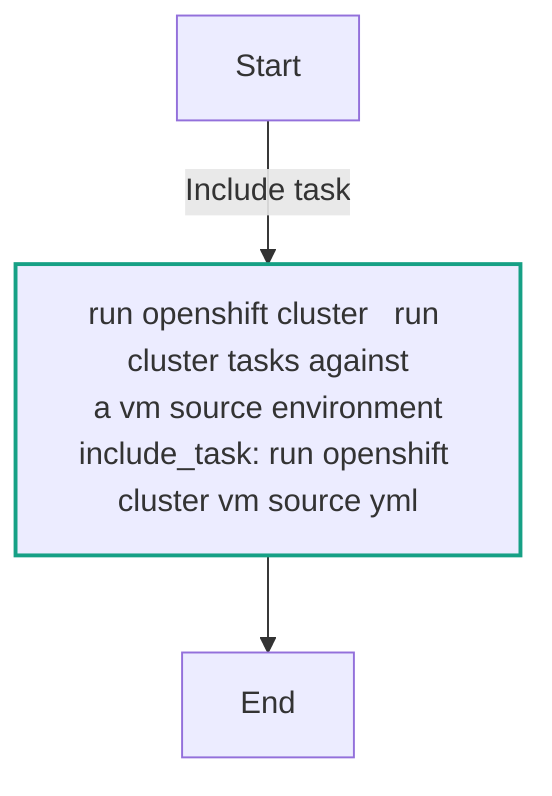

<!-- STATIC CONTENT START -->
# e2e_testing

Tooling to support E2E testing activities

<!-- STATIC CONTENT END -->
<!-- DOCSIBLE START -->
## e2e_testing

```
Role belongs to infra/openshift_virtualization_migration
Namespace - infra
Collection - openshift_virtualization_migration
Version - 1.25.0
Repository - https://github.com/redhat-cop/openshift_virtualization_migration
```

Description: Tooling to support E2E testing activities.

### Argument Specifications

<details>
<summary><b>🧩 Argument Specifications in `meta/argument_specs`</b></summary>

#### Key: main

* **Description**: ['Orchestrates end-to-end migration testing by invoking AAP job templates for MTV provider configuration, network/storage mapping, plan creation, migration execution, and optional plan archival and deletion.', 'Requires AAP credentials and inventory hosts configured with VM source environments. OpenShift connection details are resolved from environment variables or inventory variables.']
* **Options**:
  * **e2e_testing_archive_plan**:
    * **Required**: False
    * **Type**: bool
    * **Default**: True
    * **Description**: Whether to archive the MTV Plan after migration completes.
  * **e2e_testing_delete_plan**:
    * **Required**: False
    * **Type**: bool
    * **Default**: True
    * **Description**: Whether to delete the MTV Plan after migration completes.
  * **e2e_testing_destination_name**:
    * **Required**: False
    * **Type**: str
    * **Default**: host
    * **Description**: Name of the destination MTV provider.
  * **e2e_testing_migration_plan_name**:
    * **Required**: False
    * **Type**: str
    * **Default**: e2e-test
    * **Description**: Name of the MTV Plan to create for e2e testing.
  * **e2e_testing_openshift_aap_organization**:
    * **Required**: False
    * **Type**: str
    * **Default**: Default
    * **Description**: Name of the AAP organization used when launching job templates.
  * **e2e_testing_openshift_ansible_host**:
    * **Required**: False
    * **Type**: str
    * **Default**:
    * **Description**: Name of the inventory host associated with the target OpenShift cluster.
  * **e2e_testing_openshift_api_key**:
    * **Required**: True
    * **Type**: str
    * **Default**: none
    * **Description**: OpenShift API key / bearer token. Cascades from K8S_AUTH_API_KEY env var or inventory variables.
  * **e2e_testing_openshift_ca_cert_path**:
    * **Required**: False
    * **Type**: str
    * **Default**: none
    * **Description**: Path to the OpenShift CA certificate. Cascades from K8S_AUTH_SSL_CA_CERT env var or openshift_ca_cert_path inventory variable.
  * **e2e_testing_openshift_host**:
    * **Required**: True
    * **Type**: str
    * **Default**: none
    * **Description**: OpenShift host URL. Cascades from K8S_AUTH_HOST env var or openshift_host inventory variable.
  * **e2e_testing_openshift_plans_request**:
    * **Required**: False
    * **Type**: dict
    * **Default**: {}
    * **Description**: Data structure representing a plan migration request. Must contain either a 'vms' or 'folders' key when provided.
  * **e2e_testing_openshift_verify_ssl**:
    * **Required**: False
    * **Type**: bool
    * **Default**: True
    * **Description**: Whether to verify SSL certificates for OpenShift connections. Cascades from K8S_AUTH_VERIFY_SSL env var or openshift_verify_ssl inventory variable.
  * **e2e_testing_target_namespace**:
    * **Required**: False
    * **Type**: str
    * **Default**: e2e-testing
    * **Description**: Namespace where e2e testing resources are created.

</details>

### Defaults

**These are static variables with lower priority**

#### File: defaults/main.yml

| Var          | Type         | Value       |Choices    |Required    | Title       |
|--------------|--------------|-------------|-------------|-------------|-------------|
| [`e2e_testing_archive_plan`](defaults/main.yml#L77)   | bool   | `True` |  None  |   False  |  Archive the MTV Plan Name |
| [`e2e_testing_delete_plan`](defaults/main.yml#L82)   | bool   | `True` |  None  |   False  |  Delete the MTV Plan Name |
| [`e2e_testing_destination_name`](defaults/main.yml#L67)   | str   | `host` |  None  |   False  |  MTV Destination Provider |
| [`e2e_testing_migration_plan_name`](defaults/main.yml#L72)   | str   | `e2e-test` |  None  |   False  |  MTV Plan Name |
| [`e2e_testing_openshift_aap_organization`](defaults/main.yml#L57)   | str   | `Default` |  None  |   False  |  AAP Organization |
| [`e2e_testing_openshift_ansible_host`](defaults/main.yml#L52)   | str   | `` |  None  |   False  |  OpenShift Inventory Host |
| [`e2e_testing_openshift_api_key`](defaults/main.yml#L14)   | str   | `<multiline value: folded_strip>` |  None  |   True  |  OpenShift API Key |
| [`e2e_testing_openshift_ca_cert_path`](defaults/main.yml#L29)   | str   | `<multiline value: folded_strip>` |  None  |   False  |  OpenShift CA Certificate Path |
| [`e2e_testing_openshift_host`](defaults/main.yml#L6)   | str   | `<multiline value: folded_strip>` |  None  |   True  |  OpenShift Host |
| [`e2e_testing_openshift_plans_request`](defaults/main.yml#L62)   | dict   | `{}` |  None  |   False  |  Migration Plan Request |
| [`e2e_testing_openshift_verify_ssl`](defaults/main.yml#L38)   | str   | `<multiline value: folded_strip>` |  None  |   False  |  OpenShift Verify SSL |
| [`e2e_testing_target_namespace`](defaults/main.yml#L47)   | str   | `e2e-testing` |  None  |   False  |  Target Namespace |

<summary><b>🖇️ Full descriptions for vars in defaults/main.yml</b></summary>
<br>
<b>`e2e_testing_archive_plan`:</b> Whether to archive the MTV Plan
<br>
<b>`e2e_testing_delete_plan`:</b> Whether to delete the MTV Plan
<br>
<b>`e2e_testing_destination_name`:</b> Name of the destination MTV provider
<br>
<b>`e2e_testing_migration_plan_name`:</b> Name of the MTV Plan to create
<br>
<b>`e2e_testing_openshift_aap_organization`:</b> Name of the AAP Organization.
<br>
<b>`e2e_testing_openshift_ansible_host`:</b> Name of the Inventory Host associated with OpenShift.
<br>
<b>`e2e_testing_openshift_api_key`:</b> OpenShift API key.
<br>
<b>`e2e_testing_openshift_ca_cert_path`:</b> Path to the OpenShift CA Certificate.
<br>
<b>`e2e_testing_openshift_host`:</b> OpenShift host.
<br>
<b>`e2e_testing_openshift_plans_request`:</b> Data Structure Representing a Plan migration request
<br>
<b>`e2e_testing_openshift_verify_ssl`:</b> Whether to verify SSL certificates.
<br>
<b>`e2e_testing_target_namespace`:</b> Namespace to perform e2e testing.
<br>
<br>

### Vars

**These are variables with higher priority**

#### File: vars/main.yml

| Var          | Type         | Value       |
|--------------|--------------|-------------|
| [e2e_testing_openshift_aap_mtv_mapping_job_template](vars/main.yml#L5)   | str   | `OpenShift Virtualization Migration - MTV Maps` |
| [e2e_testing_openshift_aap_mtv_migrate_job_template](vars/main.yml#L7)   | str   | `OpenShift Virtualization Migration - MTV Migrate` |
| [e2e_testing_openshift_aap_mtv_plans_job_template](vars/main.yml#L6)   | str   | `OpenShift Virtualization Migration - MTV Plans` |
| [e2e_testing_openshift_aap_mtv_provider_job_template](vars/main.yml#L4)   | str   | `OpenShift Virtualization Migration - MTV Provider` |
| [e2e_testing_openshift_aap_registry_credentials_job_template](vars/main.yml#L3)   | str   | `OpenShift Virtualization Migration - Registry Credentials` |

### Tasks

#### File: tasks/configure_vddk_credentials.yml

| Name | Module | Has Conditions |
| ---- | ------ | --------- |
| configure_vddk_credentials ¦ Confirm OpenShift Ansible Host Provided | `ansible.builtin.assert` | False |
| configure_vddk_credentials ¦ Invoke Registry Credentials Job Template | `ansible.builtin.include_role` | True |

#### File: tasks/namespace_prepare.yml

| Name | Module | Has Conditions |
| ---- | ------ | --------- |
| namespace_prepare ¦ Check if e2e namespace exists | `kubernetes.core.k8s_info` | False |
| namespace_prepare ¦ Create e2e namespace if it does not exist | `redhat.openshift.k8s` | True |

#### File: tasks/run_openshift_cluster.yml

| Name | Module | Has Conditions |
| ---- | ------ | --------- |
| run_openshift_cluster ¦ Run cluster tasks against a VM source environment | `ansible.builtin.include_tasks` | False |

#### File: tasks/run_openshift_cluster_vm_source.yml

| Name | Module | Has Conditions |
| ---- | ------ | --------- |
| run_openshift_cluster_vm_source ¦ Verify Migration Request | `ansible.builtin.assert` | False |
| run_openshift_cluster_vm_source ¦ Configure MTV Providers | `ansible.builtin.include_role` | False |
| run_openshift_cluster_vm_source ¦ Configure MTV Mapping | `ansible.builtin.include_role` | False |
| run_openshift_cluster_vm_source ¦ Configure Plans | `block` | True |
| run_openshift_cluster_vm_source ¦ Prepare Migration Request | `ansible.builtin.set_fact` | False |
| run_openshift_cluster_vm_source ¦ Execute Migration Plan Job Template | `ansible.builtin.include_role` | False |
| run_openshift_cluster_vm_source ¦ Execute Migrate Job Template | `ansible.builtin.include_role` | False |
| run_openshift_cluster_vm_source ¦ Execute Migration Plan Archive Job Template | `ansible.builtin.include_role` | True |
| run_openshift_cluster_vm_source ¦ Execute Migration Plan Delete Job Template | `ansible.builtin.include_role` | True |

## Task Flow Graphs

### Graph for configure_vddk_credentials.yml



### Graph for namespace_prepare.yml



### Graph for run_openshift_cluster.yml



### Graph for run_openshift_cluster_vm_source.yml

```mermaid
flowchart TD
Start
classDef block stroke:#3498db,stroke-width:2px;
classDef task stroke:#4b76bb,stroke-width:2px;
classDef includeTasks stroke:#16a085,stroke-width:2px;
classDef importTasks stroke:#34495e,stroke-width:2px;
classDef includeRole stroke:#2980b9,stroke-width:2px;
classDef importRole stroke:#699ba7,stroke-width:2px;
classDef includeVars stroke:#8e44ad,stroke-width:2px;
classDef rescue stroke:#665352,stroke-width:2px;

  Start-->|Task| run_openshift_cluster_vm_source___Verify_Migration_Request0[run openshift cluster vm source   verify migration<br>request]:::task
  run_openshift_cluster_vm_source___Verify_Migration_Request0-->|Include role| run_openshift_cluster_vm_source___Configure_MTV_Providers_infra_aap_configuration_controller_job_launch_1(run openshift cluster vm source   configure mtv<br>providers<br>include_role: infra aap configuration controller job launch):::includeRole
  run_openshift_cluster_vm_source___Configure_MTV_Providers_infra_aap_configuration_controller_job_launch_1-->|Include role| run_openshift_cluster_vm_source___Configure_MTV_Mapping_infra_aap_configuration_controller_job_launch_2(run openshift cluster vm source   configure mtv<br>mapping<br>include_role: infra aap configuration controller job launch):::includeRole
  run_openshift_cluster_vm_source___Configure_MTV_Mapping_infra_aap_configuration_controller_job_launch_2-->|Block Start| run_openshift_cluster_vm_source___Configure_Plans3_block_start_0[[run openshift cluster vm source   configure plans<br>When: **e2e testing openshift plans request   default    <br>true    length   0**]]:::block
  run_openshift_cluster_vm_source___Configure_Plans3_block_start_0-->|Task| run_openshift_cluster_vm_source___Prepare_Migration_Request0[run openshift cluster vm source   prepare<br>migration request]:::task
  run_openshift_cluster_vm_source___Prepare_Migration_Request0-->|Include role| run_openshift_cluster_vm_source___Execute_Migration_Plan_Job_Template_infra_aap_configuration_controller_job_launch_1(run openshift cluster vm source   execute<br>migration plan job template<br>include_role: infra aap configuration controller job launch):::includeRole
  run_openshift_cluster_vm_source___Execute_Migration_Plan_Job_Template_infra_aap_configuration_controller_job_launch_1-->|Include role| run_openshift_cluster_vm_source___Execute_Migrate_Job_Template_infra_aap_configuration_controller_job_launch_2(run openshift cluster vm source   execute migrate<br>job template<br>include_role: infra aap configuration controller job launch):::includeRole
  run_openshift_cluster_vm_source___Execute_Migrate_Job_Template_infra_aap_configuration_controller_job_launch_2-->|Include role| run_openshift_cluster_vm_source___Execute_Migration_Plan_Archive_Job_Template_infra_aap_configuration_controller_job_launch_3(run openshift cluster vm source   execute<br>migration plan archive job template<br>When: **e2e testing archive plan   bool**<br>include_role: infra aap configuration controller job launch):::includeRole
  run_openshift_cluster_vm_source___Execute_Migration_Plan_Archive_Job_Template_infra_aap_configuration_controller_job_launch_3-->|Include role| run_openshift_cluster_vm_source___Execute_Migration_Plan_Delete_Job_Template_infra_aap_configuration_controller_job_launch_4(run openshift cluster vm source   execute<br>migration plan delete job template<br>When: **e2e testing delete plan   bool**<br>include_role: infra aap configuration controller job launch):::includeRole
  run_openshift_cluster_vm_source___Execute_Migration_Plan_Delete_Job_Template_infra_aap_configuration_controller_job_launch_4-.->|End of Block| run_openshift_cluster_vm_source___Configure_Plans3_block_start_0
  run_openshift_cluster_vm_source___Execute_Migration_Plan_Delete_Job_Template_infra_aap_configuration_controller_job_launch_4-->End
```



## Author Information

Red Hat

## License

GPL-3.0-only

## Minimum Ansible Version

2.15.0

## Platforms

No platforms specified.

<!-- DOCSIBLE END -->