<!-- STATIC CONTENT START -->
# utility_registry_credentials

Creates registry credentials and associates the secret to a service account

<!-- STATIC CONTENT END -->
<!-- DOCSIBLE START -->
## utility_registry_credentials

```
Role belongs to infra/openshift_virtualization_migration
Namespace - infra
Collection - openshift_virtualization_migration
Version - 1.25.0
Repository - https://github.com/redhat-cop/openshift_virtualization_migration
```

Description: Manages registry credentials in an OpenShift namespace.

### Argument Specifications

<details>
<summary><b>🧩 Argument Specifications in `meta/argument_specs`</b></summary>

#### Key: main

* **Description**: Manages registry credentials in an OpenShift namespace.
* **Options**:
  * **utility_registry_credentials_managed_by_label**:
    * **Required**: false
    * **Type**: str
    * **Default**: ansible-migration-factory
    * **Description**: Value of the app.kubernetes.io/managed-by label applied to created resources.
  * **utility_registry_credentials_namespace**:
    * **Required**: false
    * **Type**: str
    * **Default**: virtualization-migration
    * **Description**: Namespace containing the resources.
  * **utility_registry_credentials_openshift_api_key**:
    * **Required**: True
    * **Type**: str
    * **Default**: none
    * **Description**: OpenShift API key / bearer token. Cascades from K8S_AUTH_API_KEY environment variable or openshift credential inventory variables.
  * **utility_registry_credentials_openshift_ca_cert_path**:
    * **Required**: false
    * **Type**: str
    * **Default**: none
    * **Description**: Path to the OpenShift CA Certificate. Cascades from K8S_AUTH_SSL_CA_CERT environment variable or openshift_ca_cert_path inventory variable.
  * **utility_registry_credentials_openshift_host**:
    * **Required**: True
    * **Type**: str
    * **Default**: none
    * **Description**: OpenShift host URL. Cascades from K8S_AUTH_HOST environment variable or openshift_host inventory variable.
  * **utility_registry_credentials_openshift_verify_ssl**:
    * **Required**: false
    * **Type**: bool
    * **Default**: True
    * **Description**: Whether to verify SSL certificates for OpenShift connections. Cascades from K8S_AUTH_VERIFY_SSL environment variable or openshift_verify_ssl inventory variable.
  * **utility_registry_credentials_registry_host**:
    * **Required**: false
    * **Type**: str
    * **Default**: none
    * **Description**: Registry host URL (e.g., registry.redhat.io). When provided, utility_registry_credentials_registry_username and utility_registry_credentials_registry_password must also be provided to create or update registry credentials. Leave all three empty to skip credential creation.
  * **utility_registry_credentials_registry_password**:
    * **Required**: false
    * **Type**: str
    * **Default**: none
    * **Description**: Password or token for authenticating with the registry. Must be provided along with utility_registry_credentials_registry_host and utility_registry_credentials_registry_username when creating or updating registry credentials.
  * **utility_registry_credentials_registry_username**:
    * **Required**: false
    * **Type**: str
    * **Default**: none
    * **Description**: Username for authenticating with the registry. Must be provided along with utility_registry_credentials_registry_host and utility_registry_credentials_registry_password when creating or updating registry credentials.
  * **utility_registry_credentials_secret_name**:
    * **Required**: false
    * **Type**: str
    * **Default**: registry-credentials
    * **Description**: Name of the secret containing the registry credentials.
  * **utility_registry_credentials_secure_logging**:
    * **Required**: false
    * **Type**: bool
    * **Default**: True
    * **Description**: Whether to enable secure logging (no_log) for tasks that handle sensitive registry credentials. Cascades from secure_logging variable.
  * **utility_registry_credentials_service_account_create**:
    * **Required**: false
    * **Type**: bool
    * **Default**: False
    * **Description**: Whether to create the service account for the registry credentials if it doesn't exist. When false, the role will fail if the service account doesn't exist.
  * **utility_registry_credentials_service_account_name**:
    * **Required**: false
    * **Type**: str
    * **Default**: default
    * **Description**: Name of the service account to associate with the registry credentials.

</details>

### Defaults

**These are static variables with lower priority**

#### File: defaults/main.yml

| Var          | Type         | Value       |Choices    |Required    | Title       |
|--------------|--------------|-------------|-------------|-------------|-------------|
| [`utility_registry_credentials_managed_by_label`](defaults/main.yml#L93)   | str   | `ansible-migration-factory` |  None  |   False  |  Managed By Label |
| [`utility_registry_credentials_namespace`](defaults/main.yml#L68)   | str   | `virtualization-migration` |  None  |   False  |  Namespace |
| [`utility_registry_credentials_openshift_api_key`](defaults/main.yml#L23)   | str   | `<multiline value: folded_strip>` |  None  |   True  |  OpenShift API Key |
| [`utility_registry_credentials_openshift_ca_cert_path`](defaults/main.yml#L47)   | str   | `<multiline value: folded_strip>` |  None  |   False  |  OpenShift CA Certificate Path |
| [`utility_registry_credentials_openshift_host`](defaults/main.yml#L13)   | str   | `<multiline value: folded_strip>` |  None  |   True  |  OpenShift Host |
| [`utility_registry_credentials_openshift_verify_ssl`](defaults/main.yml#L38)   | str   | `<multiline value: folded_strip>` |  None  |   False  |  OpenShift Verify SSL |
| [`utility_registry_credentials_registry_host`](defaults/main.yml#L78)   | str   | `` |  None  |   False  |  Registry Host |
| [`utility_registry_credentials_registry_password`](defaults/main.yml#L88)   | str   | `` |  None  |   False  |  Registry Password |
| [`utility_registry_credentials_registry_username`](defaults/main.yml#L83)   | str   | `` |  None  |   False  |  Registry Username |
| [`utility_registry_credentials_secret_name`](defaults/main.yml#L73)   | str   | `registry-credentials` |  None  |   False  |  Secret Name |
| [`utility_registry_credentials_secure_logging`](defaults/main.yml#L6)   | str   | `{{ secure_logging ¦ default(true) }}` |  None  |   False  |  Secure Logging |
| [`utility_registry_credentials_service_account_create`](defaults/main.yml#L63)   | bool   | `False` |  None  |   False  |  Service Account Creation |
| [`utility_registry_credentials_service_account_name`](defaults/main.yml#L57)   | str   | `default` |  None  |   False  |  Service Account Name |

<summary><b>🖇️ Full descriptions for vars in defaults/main.yml</b></summary>
<br>
<b>`utility_registry_credentials_managed_by_label`:</b> Value of the app.kubernetes.io/managed-by label applied to CRs.
<br>
<b>`utility_registry_credentials_namespace`:</b> Namespace containing the resources.
<br>
<b>`utility_registry_credentials_openshift_api_key`:</b> >-
<br>
<b>`utility_registry_credentials_openshift_ca_cert_path`:</b> Path to the OpenShift CA Certificate.
<br>
<b>`utility_registry_credentials_openshift_host`:</b> >-
<br>
<b>`utility_registry_credentials_openshift_verify_ssl`:</b> Whether to verify SSL certificates for OpenShift connections.
<br>
<b>`utility_registry_credentials_registry_host`:</b> Host associated with the registry credentials.
<br>
<b>`utility_registry_credentials_registry_password`:</b> Password for the registry credentials.
<br>
<b>`utility_registry_credentials_registry_username`:</b> Username for the registry credentials.
<br>
<b>`utility_registry_credentials_secret_name`:</b> Name of the secret containing the registry credentials.
<br>
<b>`utility_registry_credentials_secure_logging`:</b> Whether to enable secure logging for sensitive tasks.
<br>
<b>`utility_registry_credentials_service_account_create`:</b> Whether to create the service account for the registry
<br>
<b>`utility_registry_credentials_service_account_name`:</b> Name of the service account to associate with the registry
<br>
<br>

### Tasks

#### File: tasks/main.yml

| Name | Module | Has Conditions |
| ---- | ------ | --------- |
| Retrieve existing registry credentials secret | `kubernetes.core.k8s_info` | False |
| Retrieve existing service account | `kubernetes.core.k8s_info` | False |
| Validate service account exists when creation is disabled | `ansible.builtin.fail` | True |
| Assert required parameters when creating registry credentials | `ansible.builtin.assert` | True |
| Create registry credentials secret | `kubernetes.core.k8s` | True |
| Ensure service account exists | `kubernetes.core.k8s` | True |
| Re-query service account | `kubernetes.core.k8s_info` | False |
| Link registry credentials secret to service account | `kubernetes.core.k8s` | True |

## Task Flow Graphs

### Graph for main.yml

```mermaid
flowchart TD
Start
classDef block stroke:#3498db,stroke-width:2px;
classDef task stroke:#4b76bb,stroke-width:2px;
classDef includeTasks stroke:#16a085,stroke-width:2px;
classDef importTasks stroke:#34495e,stroke-width:2px;
classDef includeRole stroke:#2980b9,stroke-width:2px;
classDef importRole stroke:#699ba7,stroke-width:2px;
classDef includeVars stroke:#8e44ad,stroke-width:2px;
classDef rescue stroke:#665352,stroke-width:2px;

  Start-->|Task| Retrieve_existing_registry_credentials_secret0[retrieve existing registry credentials secret]:::task
  Retrieve_existing_registry_credentials_secret0-->|Task| Retrieve_existing_service_account1[retrieve existing service account]:::task
  Retrieve_existing_service_account1-->|Task| Validate_service_account_exists_when_creation_is_disabled2[validate service account exists when creation is<br>disabled<br>When: **utility registry credentials service account<br>resources   length    0 and not  utility registry<br>credentials service account create   bool**]:::task
  Validate_service_account_exists_when_creation_is_disabled2-->|Task| Assert_required_parameters_when_creating_registry_credentials3[assert required parameters when creating registry<br>credentials<br>When: **utility registry credentials secret resources  <br>length    0 or  utility registry credentials<br>registry host is defined and  utility registry<br>credentials registry username is defined and <br>utility registry credentials registry password is<br>defined**]:::task
  Assert_required_parameters_when_creating_registry_credentials3-->|Task| Create_registry_credentials_secret4[create registry credentials secret<br>When: **utility registry credentials secret resources  <br>length    0 or  utility registry credentials<br>registry host is defined and  utility registry<br>credentials registry host   default     true   <br>length   0 and  utility registry credentials<br>registry username is defined and  utility registry<br>credentials registry username   default     true  <br> length   0 and  utility registry credentials<br>registry password is defined and  utility registry<br>credentials registry password   default     true  <br> length   0**]:::task
  Create_registry_credentials_secret4-->|Task| Ensure_service_account_exists5[ensure service account exists<br>When: **utility registry credentials service account<br>resources   length    0 and utility registry<br>credentials service account create   bool**]:::task
  Ensure_service_account_exists5-->|Task| Re_query_service_account6[re query service account]:::task
  Re_query_service_account6-->|Task| Link_registry_credentials_secret_to_service_account7[link registry credentials secret to service<br>account<br>When: **utility registry credentials service account<br>resources   length   0 and utility registry<br>credentials secret name not in       utility<br>registry credentials service account resources 0 <br>imagepullsecrets     default       map attribute <br>name     list**]:::task
  Link_registry_credentials_secret_to_service_account7-->End
```



## Author Information

Red Hat

## License

GPL-3.0-only

## Minimum Ansible Version

2.15.0

## Platforms

No platforms specified.

<!-- DOCSIBLE END -->